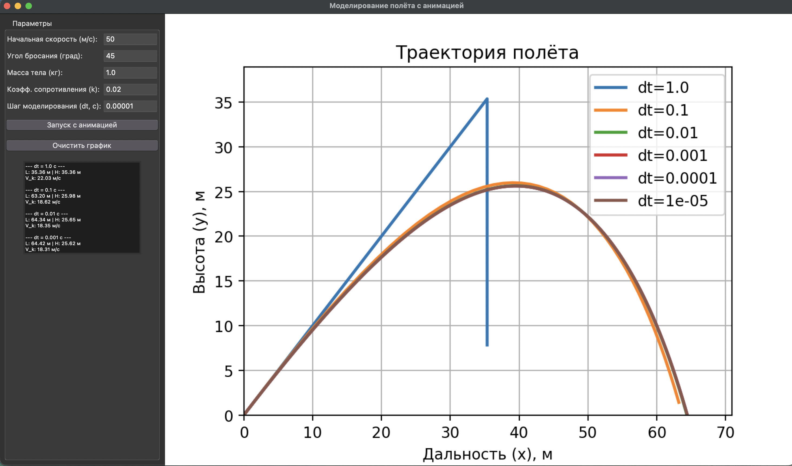

# Отчёт: Моделирование полёта тела в атмосфере

### 1. Постановка задачи
Реализовать приложение для моделирования полёта тела в атмосфере с учётом сопротивления воздуха.
**Цель работы:** Исследовать влияние шага моделирования (интегрирования) `dt` на точность расчёта траектории, дальности полёта и максимальной высоты.

### 2. Результаты моделирования
Моделирование проводилось при следующих начальных условиях:
*   Начальная скорость ($v_0$): 50 м/с
*   Угол бросания ($\alpha$): 45°
*   Масса тела ($m$): 1.0 кг
*   Коэффициент сопротивления ($k$): 0.02

#### Скриншот работы программы

#### Таблица результатов

| Шаг моделирования (dt), с | Дальность полёта (L), м | Максимальная высота (H), м | Скорость в конечной точке ($V_k$), м/с |
| :--- | :--- | :--- | :--- |
| **1.0** | 35.36 | 35.36 | 22.03 |
| **0.1** | 63.20 | 25.98 | 18.62 |
| **0.01** | 64.34 | 25.65 | 18.35 |
| **0.001** | 64.42 | 25.62 | 18.31 |
| **0.0001** | 64.43 | 25.61 | 18.31 |
| **0.00001** | 64.43 | 25.61 | 18.31 |

### 3. Выводы

1.  **Влияние шага на точность (dt = 1.0):**
    При слишком большом шаге моделирования ($dt = 1.0$ с) наблюдается **критическая погрешность**. Траектория имеет вид ломаной линии (синяя линия на графике), которая резко обрывается. Дальность полёта занижена почти в 2 раза (35 м против 64 м), а высота — завышена. Это происходит потому, что за 1 секунду скорость и силы сопротивления существенно меняются, а метод Эйлера считает их постоянными на всём шаге.

2.  **Сходимость решения:**
    При уменьшении шага с $0.1$ до $0.01$ происходит заметное уточнение результата (дальность увеличивается на ~1.1 м).
    Дальнейшее уменьшение шага ($0.001 \to 0.0001 \to 0.00001$) показывает, что результаты практически перестают меняться. Разница между шагом $0.001$ и $0.0001$ составляет всего 1 см по дальности.

3.  **Заключение:**
    Для данной физической модели и параметров полёта оптимальным шагом интегрирования является $dt \approx 0.01$ с. Он обеспечивает достаточную точность (погрешность менее 0.2% по сравнению с $dt=0.0001$) при минимальных вычислительных затратах. Дальнейшее уменьшение шага нецелесообразно, так как не вносит видимых изменений в результат.