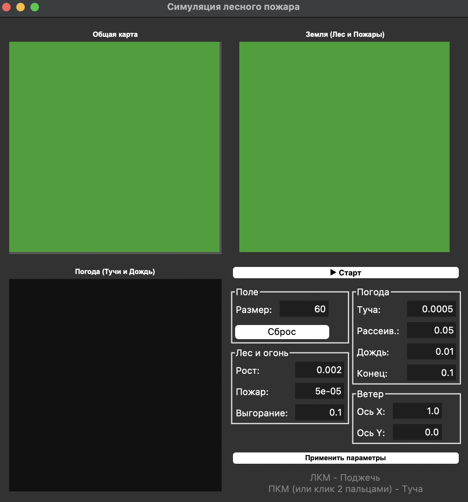
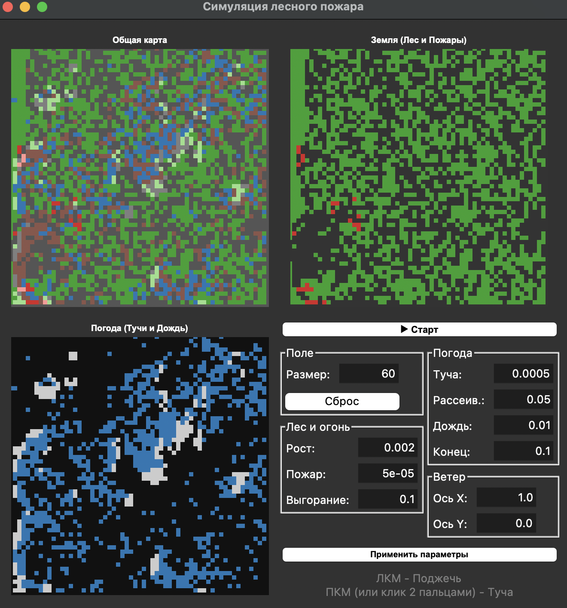

### Отчёт по работе: Моделирование лесного пожара на базе клеточного автомата

**Цель работы:** Реализовать двумерный клеточный автомат, имитирующий распространение лесного пожара.

#### 1. Базовая модель
В основе лежит классический клеточный автомат, где каждая клетка может находиться в состояниях: `tree` (дерево), `fire` (горение) или `dead/empty` (пустое место/пепел). 
- Огонь передается от соседа к соседу.
- Дерево может загореться от случайной «молнии».
- На пустом месте с определенной вероятностью вырастает новое дерево.

#### 2. Реализованные дополнительные правила (не менее трёх)
Для усложнения модели и повышения её реалистичности были внедрены следующие механики:

1.  **Влияние ветра (Wind Influence):**
    *   Введен вектор направления ветра `(wind_x, wind_y)`. 
    *   При расчёте вероятности возгорания учитывается скалярное произведение вектора ветра и вектора направления к горящему соседу. 
    *   *Результат:* По ветру пожар распространяется значительно быстрее, чем против него.

2.  **Двухслойная система «Погода — Земля»:**
    *   Параллельно с состоянием поверхности (лес) симулируется состояние атмосферы (`substatus`): чистое небо, облачность, дождь.
    *   Облака и дождь имеют свою логику распространения, также зависящую от ветра.

3.  **Механика тушения осадками:**
    *   Клетка в состоянии `rain` (дождь) имеет нулевую вероятность возгорания.
    *   Если на горящую клетку («fire») выпадают осадки, она мгновенно переходит в состояние «dead» (потушена), не дожидаясь естественного выгорания.

#### 3. Технические особенности реализации
*   **Интерфейс:** Использование библиотеки `tkinter` позволило создать три интерактивных окна визуализации (общая карта, слой леса, слой погоды).
*   **Интерактивность:** Пользователь может в реальном времени изменять параметры симуляции (вероятность роста, силу ветра, влажность) и вручную «поджигать» лес или «создавать облака» кликом мыши.

#### 4. Демонстрация работы программы
*   **Программа до запуска симуляции:**

*   **Программа после некоторого времени работы:**

#### 5. Заключение
Реализованная модель демонстрирует сложные эмерджентные свойства: возникновение локальных очагов возгорания, формирование фронтов пламени, зависящих от ветра, и естественное ограничение пожаров за счет динамических погодных систем. Модель полностью соответствует ТЗ и включает три дополнительных правила взаимодействия.