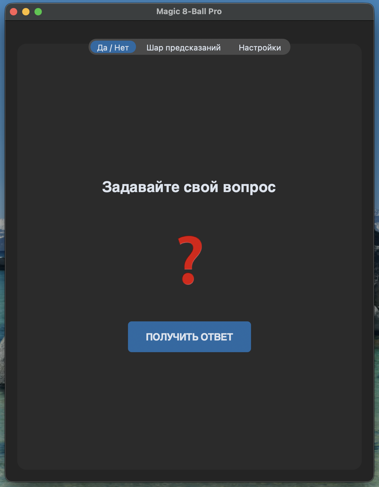
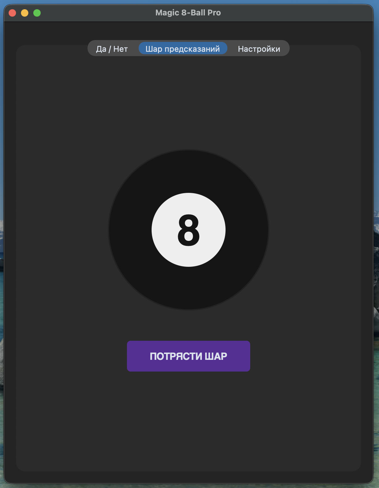
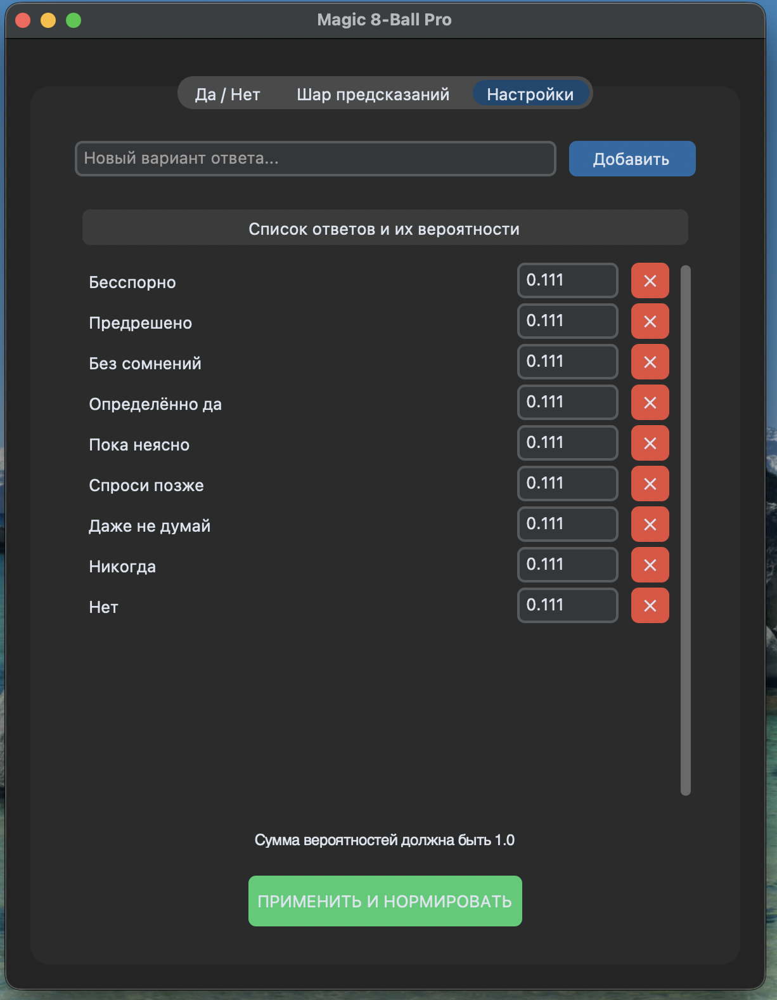

# Отчет по лабораторной работе: Моделирование случайных событий

## 1. Описание проекта
Приложение представляет собой интерактивную графическую среду для моделирования случайных величин на языке Python. Программа разделена на две функциональные части:
*   **Часть 1:** Моделирование простых логических событий («Да/Нет»).
*   **Часть 2:** Моделирование сложных событий с заданными вероятностями (Магический шар).

## 2. Генератор случайных чисел
В основе приложения лежит **Линейный конгруэнтный генератор (LCG)**. Формула:
$$X_{n+1} = (aX_n + c) \pmod m$$
*   **Параметры:** $a=16807, c=12345, m=2^{31}-1$.
*   **Инициализация:** В качестве `seed` используется текущее системное время в миллисекундах

## 3. Функциональные возможности
1.  **Интерактивная анимация:** Имитация физической «тряски» шара перед выдачей результата.
2.  **Редактор вероятностей:** Пользователь может в реальном времени добавлять, удалять варианты ответов и изменять их вероятности.
3.  **Автоматическая нормировка:** Программа контролирует сумму вероятностей. Если $\sum P_i \neq 1$, система автоматически пересчитывает веса (нормирует их к единице) и выводит уведомление пользователю.

## 4. Скриншоты приложения
*   **Да/Нет**

*   **Магический шар**

*   **Настройки**
