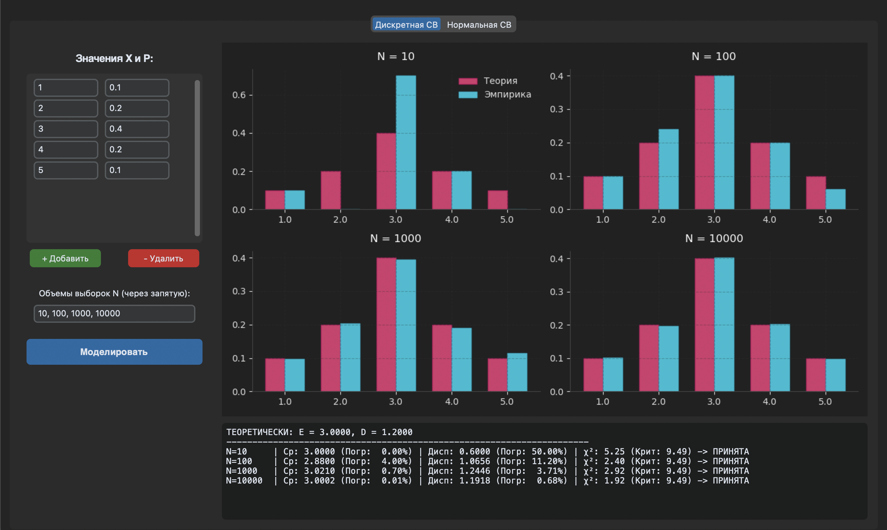
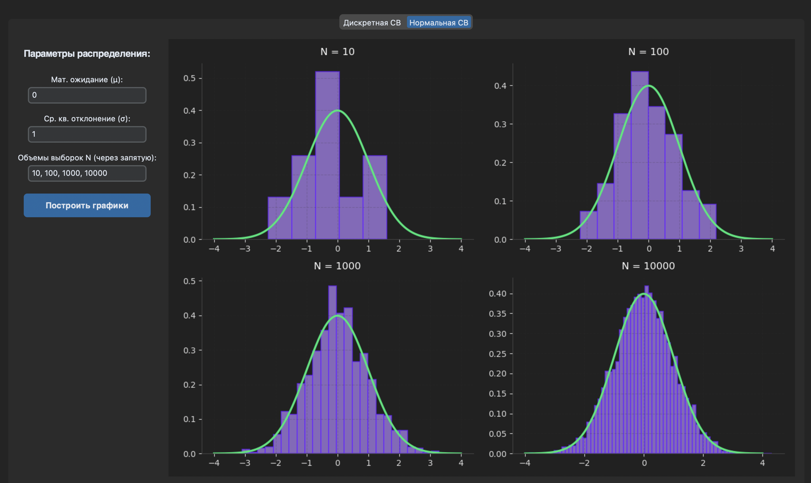

# Отчёт по лабораторной работе
**Тема:** Имитационное моделирование дискретных и непрерывных случайных величин.

### 1. Цель работы
Реализовать программный генератор дискретных (заданных рядом распределения) и непрерывных (нормальное распределение) случайных величин. Сравнить теоретические и эмпирические характеристики распределений при различных объёмах выборки ($N$) и проверить гипотезы о виде распределения с помощью критерия согласия Пирсона ($\chi^2$).

### 2. Результаты моделирования дискретной случайной величины (ДСВ)
Был смоделирован ряд распределения дискретной случайной величины. В ходе эксперимента вычислялись эмпирические частоты, выборочное среднее и выборочная дисперсия, которые затем сравнивались с теоретическими значениями.

**Анализ результатов:**
* **При $N = 10, 100$:** Наблюдается высокая относительная погрешность (часто $> 10-15\%$) выборочного среднего и дисперсии. Столбчатые диаграммы показывают заметное расхождение между теоретическими вероятностями и эмпирическими частотами. 
* **При $N = 1000, 10000$:** Относительная погрешность характеристик падает до долей процента ($< 1\%$). Высоты эмпирических столбцов на графике практически сливаются с теоретическими.
* **Критерий $\chi^2$:** При малых выборках ($N=10$) статистика $\chi^2$ часто оказывается недостоверной (из-за малых ожидаемых частот в интервалах). Однако при больших $N$ значение статистики стабилизируется ниже критического порога, и гипотеза о соответствии эмпирического распределения заданному закону **принимается**.

*(Примечание: Если сумма введенных вероятностей не равнялась 1, программа успешно проводила автоматическую нормировку).*

### 3. Результаты моделирования непрерывной случайной величины (Нормальный закон)
Был реализован генератор значений, распределенных по нормальному закону $N(\mu, \sigma^2)$. Для визуальной оценки качества моделирования были построены гистограммы эмпирических плотностей, на которые накладывался график теоретической плотности вероятности (кривая Гаусса).

**Анализ визуальных графиков:**
* **При $N = 10$:** Гистограмма хаотична, асимметрична и визуально не имеет ничего общего с колоколообразной кривой.
* **При $N = 100$:** Начинает прослеживаться концентрация значений вокруг математического ожидания $\mu$, но форма всё ещё имеет сильные "провалы" и "выбросы".
* **При $N = 1000$ и $10000$:** Гистограммы начинают соответствовать нормальному распредению.

### 4. Демонстрация работы программы

### 5. Общий вывод
В ходе лабораторной работы на практике было продемонстрировано действие **закона больших чисел (ЗБЧ)**. 

Доказано, что точность имитационного моделирования напрямую зависит от объёма выборки $N$. При малом количестве испытаний статистический шум (погрешность) слишком велик, что делает эмпирические данные ненадежными. При увеличении объёма выборки эмпирические характеристики (среднее, дисперсия, частоты) асимптотически сходятся к своим теоретическим значениям, а графики распределений принимают правильную геометрическую форму. Для получения достоверных результатов при статистическом моделировании объем выборки должен составлять не менее $N = 1000$.