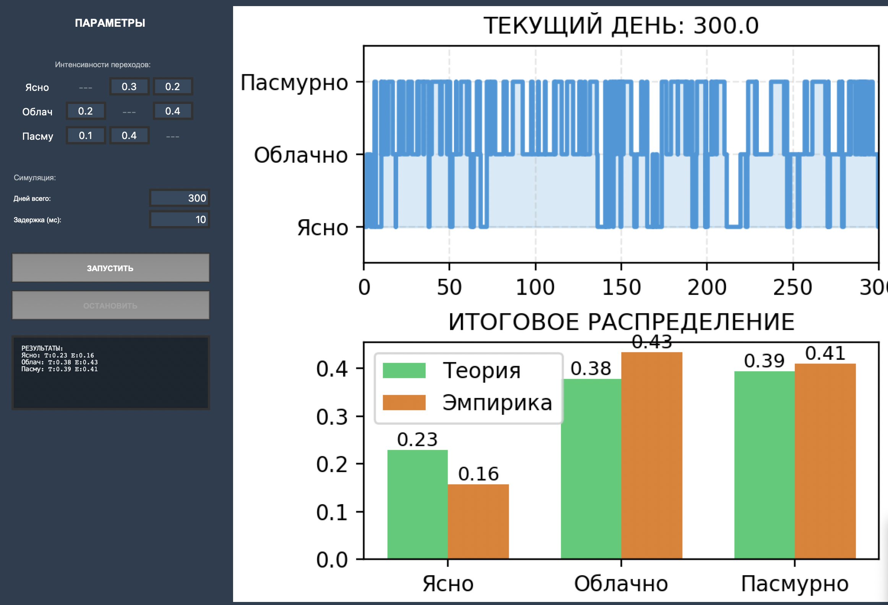

# Отчет по проекту: Марковская модель погоды

## 1. Цель работы
Разработка программного комплекса на языке Python для моделирования динамики состояний погоды (Ясно, Облачно, Пасмурно) с использованием аппарата непрерывных марковских цепей.

## 2. Описание модели
В основе модели лежит **непрерывная марковская цепь (CTMC)**. Состояния системы:
1.  **Ясно**
2.  **Облачно**
3.  **Пасмурно**

Переходы между состояниями определяются **генераторной матрицей интенсивностей $Q$**, где элемент $q_{ij}$ — интенсивность перехода из состояния $i$ в $j$. 

**Основные математические принципы:**
*   Время пребывания в каждом состоянии распределено по экспоненциальному закону с параметром $\lambda_i = -q_{ii}$.
*   Теоретическое стационарное распределение $\pi$ находится из системы уравнений: $\pi Q = 0$ при условии $\sum \pi_i = 1$.

## 3. Реализация
Программа реализована на языке **Python** с использованием следующих библиотек:
*   `NumPy`: для матричных вычислений и решения систем линейных уравнений.
*   `Matplotlib`: для построения динамических графиков и итоговых гистограмм.
*   `Tkinter`: для создания графического интерфейса пользователя (GUI).

### Ключевые возможности:
1.  **Интерактивность**: возможность задания произвольных интенсивностей переходов через GUI.
2.  **Real-time визуализация**: динамическое построение ступенчатого графика смены состояний.
3.  **Автоматизация**: расчет стационарного распределения «на лету» при изменении входных данных.
4.  **Статистический анализ**: автоматический расчет доли времени, проведенного в каждом состоянии (эмпирическое распределение), и сравнение его с теорией.

### Скриншот программы

## 4. Результаты
В ходе тестирования модели было подтверждено:
*   При увеличении общего времени моделирования ($T_{max}$) эмпирические значения стремятся к теоретическим (закон больших чисел).
*   Графический интерфейс обеспечивает корректное отображение данных без наложений благодаря использованию `constrained_layout`.
*   Визуализация позволяет наглядно отследить частоту переходов и «вязкость» (длительность пребывания) каждого типа погоды в зависимости от заданных коэффициентов.

## 5. Вывод
Разработанный инструмент позволяет наглядно демонстрировать принципы марковских процессов и может быть использован для анализа простых стохастических систем в реальном времени. Программа обладает интуитивно понятным интерфейсом и высокой точностью статистической обработки.